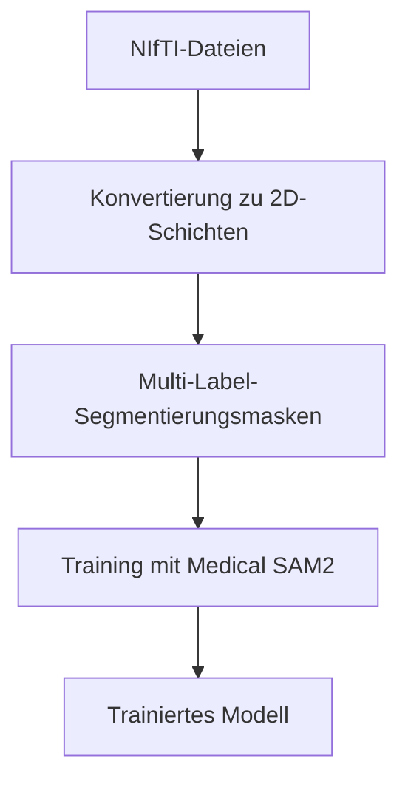
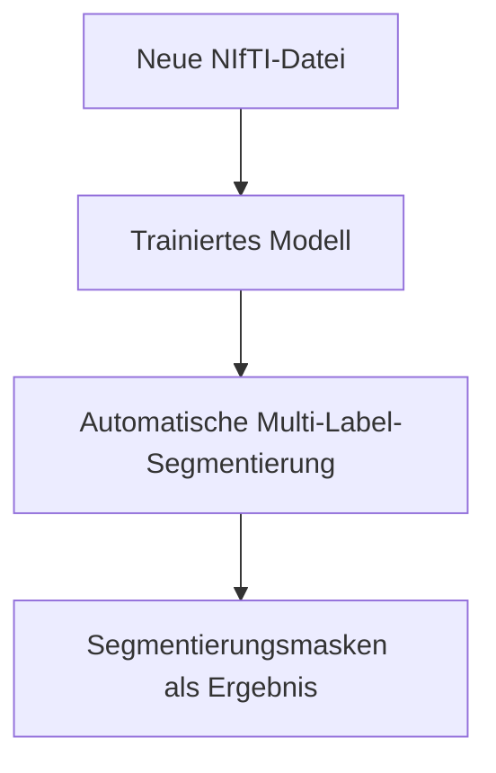

# 🏥 Medical SAM2 - Komplette Anleitung für NIfTI-Dateien

## 📋 Übersicht

Medical SAM2 ist ein fortschrittliches Segmentierungsmodell für medizinische Bilder, das **vollständig mit NIfTI (.nii) Dateien** kompatibel ist und jetzt auch auf **CPU-only Systemen** (ohne NVIDIA Grafikkarte) läuft. Die neueste Version unterstützt **Masken mit mehreren Labels**, die sich auch überschneiden können.

### ✅ **Unterstützte Dateiformate:**
- `.nii` (unkomprimiert)
- `.nii.gz` (komprimiert)
- CT-Scans, MRT-Bilder, PET-Scans
- 2D und 3D medizinische Bilddaten

### 🎯 **Neue Features:**
- **Multi-Label-Masken**: Mehrere Objekte pro Bild
- **Überschneidende Labels**: Komplexe anatomische Strukturen
- **Automatische Validierung**: Umfassende Masken-Analyse
- **Beispiel-Generatoren**: Test-Masken für Entwicklung

---

## 🚀 **Teil 1: Installation**

### **Schnellinstallation (empfohlen)**

```bash
# 1. Repository klonen
git clone https://github.com/MedicineToken/Medical-SAM2.git
cd Medical-SAM2

# 2. Automatische Installation ausführen
chmod +x install_cpu.sh
./install_cpu.sh
```

### **Manuelle Installation (bei Problemen)**

#### **Schritt 1: Umgebung erstellen**
```bash
# Verwende Python 3.10 (nicht 3.12!)
conda env create -f environment_cpu.yml
conda activate medsam2_cpu
```

#### **Schritt 2: PyTorch CPU installieren**
```bash
# Aktueller PyTorch CPU-Befehl (WICHTIG!)
pip install torch torchvision torchaudio --index-url https://download.pytorch.org/whl/cpu
```

#### **Schritt 3: Installation testen**
```bash
# PyTorch testen
python -c "import torch; print(f'PyTorch: {torch.__version__}'); print(f'CPU-Only: {not torch.cuda.is_available()}')"

# Wichtige Pakete testen
python -c "import nibabel, monai, hydra; print('✅ Alle Pakete verfügbar')"
```

#### **Schritt 4: Checkpoints herunterladen**
```bash
bash download_ckpts.sh
```

### **Installation überprüfen**

```bash
# Vollständiger Test
python -c "
import torch
import torchvision
import numpy as np
import nibabel as nib
import monai
from hydra import compose

print('✅ PyTorch:', torch.__version__)
print('✅ TorchVision:', torchvision.__version__)
print('✅ NumPy:', np.__version__)
print('✅ NiBabel:', nib.__version__)
print('✅ MONAI:', monai.__version__)
print('✅ CPU-Only Mode:', not torch.cuda.is_available())
print('\\n🎉 Installation erfolgreich!')
"
```

---

## 📁 **Teil 2: Datenvorbereitung und Masken**

### **2.1 Masken-Format verstehen**

#### **Grundlegendes Masken-Format:**
```
Jeder Pixelwert repräsentiert ein Label:
- 0 = Hintergrund
- 1, 2, 3, ... = Verschiedene Objekte/Organe
- Mehrere Labels können sich überschneiden
```

#### **Beispiel für Multi-Label-Maske:**
```python
# 3D-Maske mit mehreren Labels
mask_data[height, width, depth] = label_value

# Beispiel: Pixel (100, 150, 25) hat Label 2
mask_data[100, 150, 25] = 2

# Überschneidungen sind möglich (wird vom System erkannt)
```

### **2.2 Automatische Datenvorbereitung**

#### **Verwendung des erweiterten Beispiel-Scripts:**

```bash
# Beispiel-Script ausführen
python example_nifti_usage.py
```

**Das Script bietet jetzt:**
- ✅ **Echte Masken laden**: Anstatt Dummy-Masken zu generieren
- ✅ **Multi-Label-Unterstützung**: Mehrere Objekte pro Bild
- ✅ **Überschneidungs-Erkennung**: Automatische Analyse
- ✅ **Beispiel-Generatoren**: Test-Masken erstellen
- ✅ **Validierung**: Umfassende Masken-Prüfung

#### **Interaktive Masken-Erstellung:**

```python
# In example_nifti_usage.py
nifti_path = "path/to/your/medical_image.nii.gz"
mask_path = "path/to/your/mask_image.nii.gz"  # Optional

# Script fragt interaktiv:
# "Möchten Sie Beispiel-Maskendaten erstellen? (j/n)"
# 
# Verfügbare Optionen:
# 1. Einfache Masken (verschiedene Labels)
# 2. Überschneidende Masken (Labels überlappen sich)
```

### **2.3 Manuelle Masken-Erstellung**

#### **Option 1: Manuelle Annotation (empfohlen für wenige Bilder)**
```bash
# Tools für manuelle Segmentierung:
- 3D Slicer (kostenlos): https://www.slicer.org/
- ITK-SNAP (kostenlos): http://www.itksnap.org/
- MITK Workbench (kostenlos): https://www.mitk.org/
- ImageJ/Fiji (kostenlos): https://imagej.net/software/fiji/
```

#### **Option 2: Semi-automatische Tools**
```bash
# Vortrainierte Modelle verwenden:
- nnU-Net für verschiedene Organe
- TotalSegmentator für CT-Scans
- FreeSurfer für Gehirn-MRT
```

#### **Option 3: Programmatische Erstellung**
```python
# Beispiel: Schwellenwert-basierte Segmentierung
def create_simple_mask(ct_data, threshold_min=-100, threshold_max=200):
    """Erstellt einfache Maske basierend auf Hounsfield-Werten"""
    mask = np.zeros_like(ct_data)
    mask[(ct_data >= threshold_min) & (ct_data <= threshold_max)] = 1
    return mask.astype(np.uint8)

# Beispiel: Multi-Label-Maske
def create_multilabel_mask(ct_data):
    """Erstellt Maske mit mehreren Labels"""
    mask = np.zeros_like(ct_data)
    
    # Label 1: Leber (Hounsfield -10 bis 30)
    mask[(ct_data >= -10) & (ct_data <= 30)] = 1
    
    # Label 2: Nieren (Hounsfield 20 bis 40)
    mask[(ct_data >= 20) & (ct_data <= 40)] = 2
    
    # Label 3: Milz (Hounsfield 30 bis 60)
    mask[(ct_data >= 30) & (ct_data <= 60)] = 3
    
    return mask.astype(np.uint8)
```

### **2.4 Datenstruktur**

#### **Automatische Struktur (empfohlen):**
```
data/
└── ihr_datensatz/
    ├── Training/
    │   ├── image/
    │   │   └── case_001/
    │   │       ├── 0.jpg
    │   │       ├── 1.jpg
    │   │       └── ...
    │   └── mask/
    │       └── case_001/
    │           ├── 0.npy
    │           ├── 1.npy
    │           └── ...
    └── Test/
        ├── image/
        └── mask/
```

#### **Manuelle Konvertierung:**
```python
import nibabel as nib
import numpy as np
from PIL import Image
import os

def convert_nifti_to_sam2_format(nifti_path, mask_path=None, output_dir="./data/mein_datensatz"):
    """Konvertiert NIfTI-Datei in Medical SAM2 Format mit optionalen Masken"""
    
    # NIfTI laden
    nii_img = nib.load(nifti_path)
    img_data = nii_img.get_fdata()
    
    # Masken laden (falls vorhanden)
    mask_data = None
    if mask_path and os.path.exists(mask_path):
        mask_nii = nib.load(mask_path)
        mask_data = mask_nii.get_fdata()
        print(f"Masken geladen: {mask_data.shape}, Labels: {np.unique(mask_data)}")
    
    # Ordner erstellen
    image_dir = os.path.join(output_dir, 'Training', 'image', 'case_001')
    mask_dir = os.path.join(output_dir, 'Training', 'mask', 'case_001')
    os.makedirs(image_dir, exist_ok=True)
    os.makedirs(mask_dir, exist_ok=True)
    
    # Normalisierung
    img_data = np.clip(img_data, np.percentile(img_data, 1), np.percentile(img_data, 99))
    img_data = (img_data - img_data.min()) / (img_data.max() - img_data.min())
    img_data = (img_data * 255).astype(np.uint8)
    
    # Jede Schicht speichern
    for slice_idx in range(img_data.shape[2]):
        # 2D Schicht
        slice_2d = img_data[:, :, slice_idx]
        
        # RGB konvertieren
        slice_rgb = np.stack([slice_2d, slice_2d, slice_2d], axis=-1)
        
        # Als Bild speichern
        pil_img = Image.fromarray(slice_rgb)
        pil_img = pil_img.resize((512, 512))  # SAM2 Standardgröße
        pil_img.save(os.path.join(image_dir, f'{slice_idx}.jpg'))
        
        # Maske für diese Schicht
        if mask_data is not None and slice_idx < mask_data.shape[2]:
            mask_slice = mask_data[:, :, slice_idx]
            mask_pil = Image.fromarray(mask_slice.astype(np.uint8))
            mask_pil = mask_pil.resize((512, 512), Image.NEAREST)
            mask_slice_resized = np.array(mask_pil)
        else:
            # Dummy-Maske (nur wenn keine echte Maske vorhanden)
            mask_slice_resized = np.zeros((512, 512), dtype=np.uint8)
        
        np.save(os.path.join(mask_dir, f'{slice_idx}.npy'), mask_slice_resized)

# Verwendung:
convert_nifti_to_sam2_format('ihr_ct_scan.nii.gz', 'ihre_masken.nii.gz', './data/mein_datensatz')
```

---

## 🎯 **Teil 3: Training**

### **3.1 Training starten**

#### **3D Training (für Volumen-Segmentierung):**

```bash
# CPU-Only Training
python train_3d.py \
    -net sam2 \
    -exp_name Mein_NIfTI_Experiment \
    -sam_ckpt ./checkpoints/sam2_hiera_small.pt \
    -sam_config sam2_hiera_s \
    -image_size 512 \
    -val_freq 5 \
    -prompt bbox \
    -prompt_freq 2 \
    -dataset btcv \
    -data_path ./data/mein_datensatz \
    -gpu False \
    -b 1

# GPU Training (falls verfügbar)
python train_3d.py \
    -net sam2 \
    -exp_name Mein_NIfTI_Experiment_GPU \
    -sam_ckpt ./checkpoints/sam2_hiera_small.pt \
    -sam_config sam2_hiera_s \
    -image_size 1024 \
    -val_freq 5 \
    -prompt bbox \
    -prompt_freq 2 \
    -dataset btcv \
    -data_path ./data/mein_datensatz \
    -b 2
```

#### **2D Training (für Schicht-basierte Segmentierung):**

```bash
# CPU-Only Training
python train_2d.py \
    -net sam2 \
    -exp_name Mein_2D_NIfTI_Experiment \
    -vis 1 \
    -sam_ckpt ./checkpoints/sam2_hiera_small.pt \
    -sam_config sam2_hiera_s \
    -image_size 512 \
    -out_size 512 \
    -b 1 \
    -val_freq 5 \
    -dataset REFUGE \
    -data_path ./data/mein_datensatz \
    -gpu False
```

### **3.2 Parameter-Anpassung für verschiedene Anwendungsfälle**

#### **CT-Scans (Computertomographie):**
```bash
python train_3d.py \
    -image_size 512 \
    -prompt bbox \
    -prompt_freq 3 \
    -b 1
```

#### **MRT-Bilder (Magnetresonanztomographie):**
```bash
python train_3d.py \
    -image_size 768 \
    -prompt click \
    -prompt_freq 2 \
    -b 1
```

#### **Kleine Strukturen (z.B. Läsionen):**
```bash
python train_2d.py \
    -image_size 1024 \
    -out_size 1024 \
    -b 1
```

### **3.3 Training überwachen**

```bash
# TensorBoard starten
tensorboard --logdir logs/

# Im Browser öffnen: http://localhost:6006
```

**Ergebnisse finden:**
- **Modelle:** `logs/[experiment_name]/Model/`
- **Logs:** `logs/[experiment_name]/Log/`
- **Visualisierungen:** `logs/[experiment_name]/Samples/`

---

## 🚀 **Teil 4: Anwendung (Inferenz)**

### **4.1 Der komplette Workflow verstehen**

#### **Phase 1: Training (was das Beispiel-Script macht) 🎓**


#### **Phase 2: Inferenz/Anwendung (die eigentliche Nutzung) 🚀**


### **4.2 Anwendung auf neue Bilder**

#### **Einfache Inferenz:**
```python
# Nach dem Training: Neue CT-Scans automatisch segmentieren
import torch
from sam2_train.build_sam import build_sam2_video_predictor

# Trainiertes Modell laden
model = build_sam2_video_predictor(
    config_file="sam2_hiera_s", 
    ckpt_path="./logs/Mein_NIfTI_Experiment/Model/latest_epoch.pth",
    device="cpu"
)

# Neue CT-Datei automatisch segmentieren
new_ct = "unbekannter_patient.nii.gz"
segmented_result = model.predict(new_ct)  # Automatisch!
```

#### **Vereinfachter Inferenz-Script:**
```python
def segment_new_nifti(nifti_path, model_path):
    """Segmentiert neue NIfTI-Datei mit trainiertem Modell"""
    
    # 1. Modell laden
    model = load_trained_model(model_path)
    
    # 2. NIfTI laden
    nii_data = nib.load(nifti_path).get_fdata()
    
    # 3. Automatisch segmentieren
    segmentation = model.predict(nii_data)
    
    # 4. Ergebnis speichern
    save_segmentation(segmentation, f"{nifti_path}_segmented.nii.gz")
    
    return segmentation

# Verwendung (sehr einfach!):
result = segment_new_nifti("neuer_patient.nii.gz", "mein_trainiertes_modell.pth")
```

### **4.3 Praktisches Beispiel: Multi-Organ-Segmentierung**

#### **Training vorbereiten:**
```python
# Sie haben 50 CT-Scans und wollen mehrere Organe segmentieren
ct_scans = [
    "patient_001.nii.gz",  # Original CT
    "patient_002.nii.gz",
    # ... weitere 48 Dateien
]

# Multi-Label-Masken mit mehreren Organen:
multi_organ_masks = [
    "patient_001_multi_organ_mask.nii.gz",  # Labels: 1=Leber, 2=Niere, 3=Milz
    "patient_002_multi_organ_mask.nii.gz",  # Labels: 1=Leber, 2=Niere, 3=Milz
    # ... weitere 48 Masken
]
```

#### **Training durchführen:**
```bash
# Das erweiterte example_nifti_usage.py konvertiert und startet Training
python example_nifti_usage.py

# Oder direkt:
python train_3d.py \
    -exp_name Multi_Organ_Segmentierung \
    -data_path ./data/multi_organ_training_daten \
    -gpu False
```

#### **Anwendung auf neue Bilder:**
```python
# Nach dem Training: Neue CT-Scans automatisch segmentieren
new_ct = "unbekannter_patient.nii.gz"
segmented_organs = model.predict(new_ct)  # Automatisch alle Organe!

# Ergebnis enthält:
# - Label 1: Leber-Segmentierung
# - Label 2: Nieren-Segmentierung  
# - Label 3: Milz-Segmentierung
```

---

## 💡 **Teil 5: Praktische Tipps und Optimierung**

### **5.1 Datenvorverarbeitung**

#### **Intensitätsnormalisierung für CT:**
```python
def normalize_ct(img_data, window_center=40, window_width=400):
    img_min = window_center - window_width // 2
    img_max = window_center + window_width // 2
    img_data = np.clip(img_data, img_min, img_max)
    return (img_data - img_min) / (img_max - img_min)
```

#### **Intensitätsnormalisierung für MRT:**
```python
def normalize_mri(img_data):
    return (img_data - img_data.mean()) / img_data.std()
```

### **5.2 Multi-Label-Masken erstellen**

#### **Beispiel für binäre Segmentierung:**
```python
def create_binary_mask(mask_data, target_label=1):
    binary_mask = (mask_data == target_label).astype(np.uint8)
    return binary_mask
```

#### **Beispiel für Multi-Class Segmentierung:**
```python
def create_multiclass_mask(mask_data, label_mapping):
    output_mask = np.zeros_like(mask_data)
    for old_label, new_label in label_mapping.items():
        output_mask[mask_data == old_label] = new_label
    return output_mask
```

### **5.3 Datenaugmentation**

```python
# Rotation und Flip für medizinische Bilder
def augment_medical_data(img_data, mask_data):
    # Zufällige Rotation
    angle = np.random.uniform(-15, 15)
    img_rotated = rotate(img_data, angle, reshape=False)
    mask_rotated = rotate(mask_data, angle, reshape=False)
    
    # Zufälliger Flip
    if np.random.random() > 0.5:
        img_rotated = np.fliplr(img_rotated)
        mask_rotated = np.fliplr(mask_rotated)
    
    return img_rotated, mask_rotated
```

### **5.4 Performance-Optimierung**

#### **CPU-Optimierung:**
```bash
# Anzahl der CPU-Kerne nutzen
export OMP_NUM_THREADS=4
export MKL_NUM_THREADS=4

# Speicher-effizientes Training
python train_3d.py -b 1 -image_size 256
```

#### **Speicher-Optimierung:**
```python
# Gradient Checkpointing aktivieren
torch.utils.checkpoint.checkpoint_sequential()

# Mixed Precision für GPU
torch.cuda.amp.autocast()
```

---

## ⚠️ **Teil 6: Fehlerbehebung**

### **6.1 Häufige Probleme und Lösungen**

#### **Problem: Python 3.12 Kompatibilitätsprobleme**
**Lösung:**
```bash
# Verwenden Sie Python 3.10 für beste Kompatibilität
conda env remove -n medsam2_cpu
conda clean --all
./install_cpu.sh
```

#### **Problem: PyTorch Installation schlägt fehl**
**Lösung:**
```bash
# Verwenden Sie den aktuellen PyTorch CPU-Befehl
conda activate medsam2_cpu
pip uninstall torch torchvision torchaudio
pip install torch torchvision torchaudio --index-url https://download.pytorch.org/whl/cpu
```

#### **Problem: "CUDA out of memory"**
**Lösung:**
```bash
# Kleinere Batch-Größe verwenden
-b 1

# Kleinere Bildgröße verwenden
-image_size 256

# CPU-Only Modus verwenden
-gpu False
```

#### **Problem: "ModuleNotFoundError" bei wichtigen Paketen**
**Lösung:**
```bash
# Fehlende Pakete nachinstallieren
conda activate medsam2_cpu
pip install nibabel monai hydra-core omegaconf

# Alle Abhängigkeiten überprüfen
python -c "
import torch, torchvision, numpy, PIL, nibabel, monai
print('✅ Alle wichtigen Pakete verfügbar!')
"
```

#### **Problem: "NIfTI-Datei kann nicht geladen werden"**
**Lösung:**
```python
# Überprüfen Sie das Dateiformat
import nibabel as nib
try:
    img = nib.load('ihre_datei.nii.gz')
    print("Datei erfolgreich geladen")
    print(f"Shape: {img.shape}, Dtype: {img.get_fdata().dtype}")
except Exception as e:
    print(f"Fehler: {e}")
    # Versuchen Sie verschiedene Dateierweiterungen
    # .nii, .nii.gz, .hdr/.img
```

#### **Problem: "Masken-Form-Mismatch"**
**Lösung:**
```python
# Überprüfen Sie die Masken-Validierung
from example_nifti_usage import validate_mask_data
validate_mask_data(mask_data, img_data)

# Stellen Sie sicher, dass Bild- und Maskendaten die gleiche Form haben
print(f"Bild-Form: {img_data.shape}")
print(f"Masken-Form: {mask_data.shape}")
```

#### **Problem: "Schlechte Segmentierungsergebnisse"**
**Lösungen:**
1. **Mehr Trainingsdaten:** Mindestens 50-200 annotierte Fälle
2. **Bessere Vorverarbeitung:** Normalisierung anpassen
3. **Hyperparameter-Tuning:** Learning Rate, Batch Size anpassen
4. **Transfer Learning:** Von vortrainierten Modellen starten
5. **Multi-Label-Optimierung:** Verwenden Sie die neuen Masken-Features

### **6.2 Debugging-Tipps**

1. **Verwenden Sie die Validierung**:
   ```python
   from example_nifti_usage import validate_mask_data
   validate_mask_data(mask_data, img_data)
   ```

2. **Testen Sie mit Beispiel-Daten**:
   ```python
   from example_nifti_usage import create_example_mask_data
   create_example_mask_data(img_shape)
   ```

3. **Überprüfen Sie die Visualisierung**:
   ```python
   from example_nifti_usage import visualize_nifti_slices
   visualize_nifti_slices(img_data, mask_data)
   ```

---

## 📊 **Teil 7: Anwendungsbeispiele**

### **7.1 Leber-Segmentierung in CT-Scans:**
```bash
python train_3d.py \
    -exp_name Leber_Segmentierung \
    -image_size 512 \
    -prompt bbox \
    -data_path ./data/leber_ct_daten \
    -gpu False
```

### **7.2 Multi-Organ-Segmentierung:**
```bash
python train_3d.py \
    -exp_name Multi_Organ_Segmentierung \
    -image_size 512 \
    -prompt bbox \
    -data_path ./data/multi_organ_daten \
    -gpu False
```

### **7.3 Gehirntumor-Erkennung in MRT:**
```bash
python train_3d.py \
    -exp_name Gehirntumor_MRT \
    -image_size 768 \
    -prompt click \
    -data_path ./data/gehirn_mrt_daten \
    -gpu False
```

### **7.4 Lungen-Segmentierung:**
```bash
python train_3d.py \
    -exp_name Lungen_Segmentierung \
    -image_size 512 \
    -prompt bbox \
    -data_path ./data/lungen_ct_daten \
    -gpu False
```

---

## 📈 **Teil 8: Aufwand-Nutzen-Analyse**

### **Einmalige Investition (Training):**
- ⏰ **Zeit:** 2-4 Wochen für Datensammlung und Training
- 👥 **Personal:** Medizinische Expertise für Annotation
- 💻 **Hardware:** CPU-Training möglich (langsamer)
- 📚 **Daten:** 50-200 annotierte Fälle empfohlen

### **Langfristiger Nutzen (Anwendung):**
- ⚡ **Geschwindigkeit:** Sekunden statt Stunden pro Segmentierung
- 🎯 **Konsistenz:** Gleichbleibende Qualität
- 💰 **Kostenersparnis:** Automatisierte Verarbeitung
- 📈 **Skalierbarkeit:** Tausende von Bildern verarbeitbar
- 🏷️ **Multi-Label:** Mehrere Organe gleichzeitig segmentieren

---

## 🎯 **Teil 9: Praktische Empfehlungen**

### **Für Einsteiger:**
```bash
# 1. Starten Sie mit vortrainierten Modellen
# 2. Sammeln Sie 10-20 gut annotierte Beispiele
# 3. Verwenden Sie die neuen Beispiel-Masken-Generatoren
# 4. Führen Sie ein kleines Training durch
# 5. Testen Sie die Ergebnisse
# 6. Erweitern Sie schrittweise Ihren Datensatz
```

### **Für Fortgeschrittene:**
```bash
# 1. Verwenden Sie Transfer Learning
# 2. Implementieren Sie Data Augmentation
# 3. Nutzen Sie Multi-Label-Masken für komplexe Strukturen
# 4. Optimieren Sie Hyperparameter
# 5. Validieren Sie mit unabhängigen Testdaten
# 6. Deployen Sie in der klinischen Routine
```

---

## 🆘 **Teil 10: Support und Community**

- **GitHub Issues:** [Medical SAM2 Issues](https://github.com/MedicineToken/Medical-SAM2/issues)
- **Dokumentation:** Siehe README.md im Repository
- **Beispiele:** Verwenden Sie `example_nifti_usage.py`
- **Masken-Upgrade:** Siehe `MASKEN_UPGRADE_README.md`

---

## 📝 **Teil 11: Lizenz und Zitation**

Wenn Sie Medical SAM2 in Ihrer Forschung verwenden, zitieren Sie bitte:

```bibtex
@misc{zhu2024medical,
    title={Medical SAM 2: Segment medical images as video via Segment Anything Model 2},
    author={Jiayuan Zhu and Abdullah Hamdi and Yunli Qi and Yueming Jin and Junde Wu},
    year={2024},
    eprint={2408.00874},
    archivePrefix={arXiv},
    primaryClass={cs.CV}
}
```

---

## ✅ **Zusammenfassung**

Medical SAM2 ist **vollständig kompatibel** mit NIfTI-Dateien und bietet jetzt:

- ✅ **CPU-Only Support** (keine NVIDIA GPU erforderlich)
- ✅ **Multi-Label-Masken** mit Überschneidungs-Unterstützung
- ✅ **Automatische NIfTI-Verarbeitung** mit nibabel
- ✅ **2D und 3D Segmentierung**
- ✅ **Beispiel-Masken-Generatoren** für Tests
- ✅ **Umfassende Validierung** und Visualisierung
- ✅ **Deutsche Anleitung und Support**
- ✅ **Beispiel-Scripts** für einfachen Einstieg

### **Der Workflow ist:**
```
Ihre NIfTI-Dateien + Multi-Label-Masken → Training → Trainiertes Modell → Automatische Multi-Organ-Segmentierung neuer Dateien
```

**Das Training ist eine einmalige Investition für langfristige Automatisierung!** 🎉

**Viel Erfolg bei Ihren medizinischen Segmentierungsprojekten! 🏥**