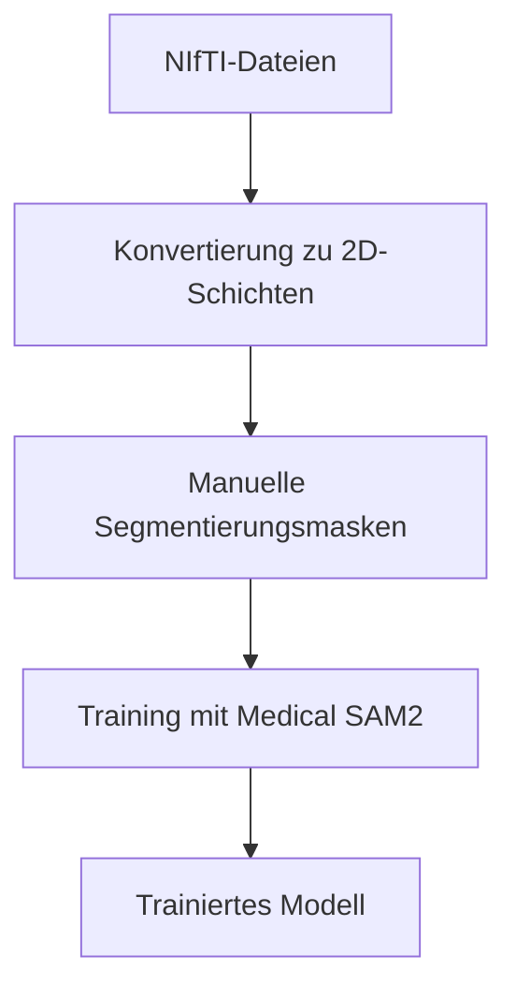
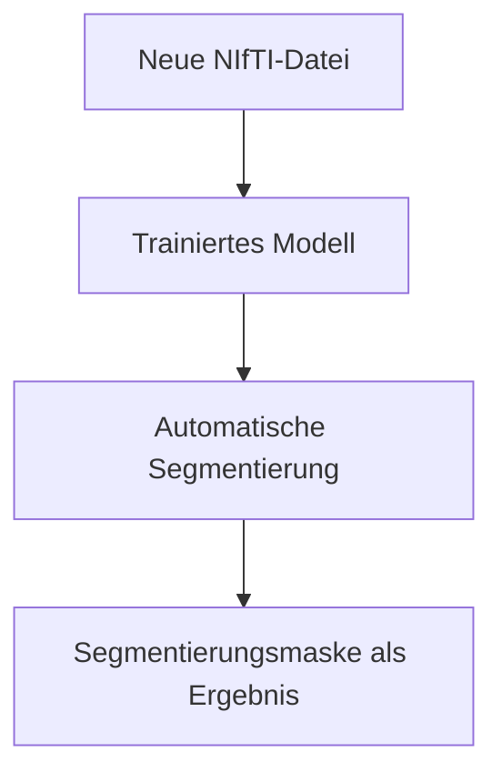

# 🏥 Medical SAM2 - Vollständiger Workflow Erklärt

## 🎯 **Die wichtige Unterscheidung: Training vs. Inferenz**

### **Das `example_nifti_usage.py` Script führt TRAINING durch, nicht die finale Anwendung!**

## 📋 **1. Was bedeutet "Segmentierungsmasken erstellen"?**

### **Segmentierungsmasken sind "Antwortschlüssel" für das Training:**

```python
# Beispiel einer Segmentierungsmaske:
# 0 = Hintergrund (schwarz)
# 1 = Organ/Struktur von Interesse (weiß)
# 2 = Anderes Organ (grau)

mask = np.array([
    [0, 0, 0, 0, 0],  # Hintergrund
    [0, 1, 1, 1, 0],  # Leber (Beispiel)
    [0, 1, 1, 1, 0],  # Leber
    [0, 2, 2, 2, 0],  # Niere (Beispiel)
    [0, 0, 0, 0, 0]   # Hintergrund
])
```

### **Wie erstellt man echte Segmentierungsmasken?**

#### **Option 1: Manuelle Annotation (empfohlen für wenige Bilder)**
```bash
# Tools für manuelle Segmentierung:
- 3D Slicer (kostenlos): https://www.slicer.org/
- ITK-SNAP (kostenlos): http://www.itksnap.org/
- MITK Workbench (kostenlos): https://www.mitk.org/
- ImageJ/Fiji (kostenlos): https://imagej.net/software/fiji/
```

#### **Option 2: Semi-automatische Tools**
```bash
# Vortrainierte Modelle verwenden:
- nnU-Net für verschiedene Organe
- TotalSegmentator für CT-Scans
- FreeSurfer für Gehirn-MRT
```

#### **Option 3: Programmatische Erstellung (für einfache Fälle)**
```python
# Beispiel: Schwellenwert-basierte Segmentierung
def create_simple_mask(ct_data, threshold_min=-100, threshold_max=200):
    """Erstellt einfache Maske basierend auf Hounsfield-Werten"""
    mask = np.zeros_like(ct_data)
    mask[(ct_data >= threshold_min) & (ct_data <= threshold_max)] = 1
    return mask.astype(np.uint8)
```

---

## 🔄 **2. Der komplette Medical SAM2 Workflow**

### **Phase 1: Training (was das Beispiel-Script macht) 🎓**



**Das passiert beim Training:**
1. **Input:** Ihre medizinischen Bilder + manuell erstellte Masken
2. **Prozess:** Das Modell lernt, ähnliche Strukturen zu erkennen
3. **Output:** Ein spezialisiertes Modell für Ihre spezifische Aufgabe

### **Phase 2: Inferenz/Anwendung (die eigentliche Nutzung) 🚀**



**Das passiert bei der Anwendung:**
1. **Input:** Neue, unbekannte medizinische Bilder
2. **Prozess:** Das trainierte Modell segmentiert automatisch
3. **Output:** Fertige Segmentierungsmasken ohne manuellen Aufwand

---

## 🎯 **3. Praktisches Beispiel: Leber-Segmentierung**

### **Schritt 1: Training vorbereiten**
```python
# Sie haben 50 CT-Scans und wollen Leber segmentieren
ct_scans = [
    "patient_001.nii.gz",  # Original CT
    "patient_002.nii.gz",
    # ... weitere 48 Dateien
]

# Sie müssen manuell Lebern markieren:
liver_masks = [
    "patient_001_liver_mask.nii.gz",  # Manuell erstellt!
    "patient_002_liver_mask.nii.gz",  # Manuell erstellt!
    # ... weitere 48 Masken
]
```

### **Schritt 2: Training durchführen**
```bash
# Das example_nifti_usage.py konvertiert und startet Training
python example_nifti_usage.py

# Oder direkt:
python train_3d.py \
    -exp_name Leber_Segmentierung \
    -data_path ./data/leber_training_daten \
    -gpu False
```

### **Schritt 3: Anwendung auf neue Bilder**
```python
# Nach dem Training: Neue CT-Scans automatisch segmentieren
import torch
from sam2_train.build_sam import build_sam2_video_predictor

# Trainiertes Modell laden
model = build_sam2_video_predictor(
    config_file="sam2_hiera_s", 
    ckpt_path="./logs/Leber_Segmentierung/Model/latest_epoch.pth",
    device="cpu"
)

# Neue CT-Datei automatisch segmentieren
new_ct = "unbekannter_patient.nii.gz"
segmented_liver = model.predict(new_ct)  # Automatisch!
```

---

## 🤔 **4. Ist das der normale Workflow?**

### **Ja, das ist der Standard-Workflow für Medical SAM2:**

#### **Für Forschung/Entwicklung:**
1. ✅ **Training:** Sammeln Sie annotierte Daten (das macht das Beispiel-Script)
2. ✅ **Anwendung:** Verwenden Sie das trainierte Modell auf neuen Daten

#### **Für klinische Anwendung:**
1. ✅ **Vortrainierte Modelle:** Verwenden Sie bereits trainierte Modelle
2. ✅ **Fine-Tuning:** Passen Sie an Ihre spezifischen Daten an
3. ✅ **Deployment:** Wenden Sie das Modell routinemäßig an

---

## 🚀 **5. Vereinfachte Anwendung nach dem Training**

### **Nach erfolgreichem Training können Sie Medical SAM2 sehr einfach anwenden:**

```python
# Einfacher Inferenz-Script (nach Training)
def segment_new_nifti(nifti_path, model_path):
    """Segmentiert neue NIfTI-Datei mit trainiertem Modell"""
    
    # 1. Modell laden
    model = load_trained_model(model_path)
    
    # 2. NIfTI laden
    nii_data = nib.load(nifti_path).get_fdata()
    
    # 3. Automatisch segmentieren
    segmentation = model.predict(nii_data)
    
    # 4. Ergebnis speichern
    save_segmentation(segmentation, f"{nifti_path}_segmented.nii.gz")
    
    return segmentation

# Verwendung (sehr einfach!):
result = segment_new_nifti("neuer_patient.nii.gz", "mein_trainiertes_modell.pth")
```

---

## 📊 **6. Aufwand-Nutzen-Analyse**

### **Einmalige Investition (Training):**
- ⏰ **Zeit:** 2-4 Wochen für Datensammlung und Training
- 👥 **Personal:** Medizinische Expertise für Annotation
- 💻 **Hardware:** CPU-Training möglich (langsamer)
- 📚 **Daten:** 50-200 annotierte Fälle empfohlen

### **Langfristiger Nutzen (Anwendung):**
- ⚡ **Geschwindigkeit:** Sekunden statt Stunden pro Segmentierung
- 🎯 **Konsistenz:** Gleichbleibende Qualität
- 💰 **Kostenersparnis:** Automatisierte Verarbeitung
- 📈 **Skalierbarkeit:** Tausende von Bildern verarbeitbar

---

## 💡 **7. Praktische Empfehlungen**

### **Für Einsteiger:**
```bash
# 1. Starten Sie mit vortrainierten Modellen
# 2. Sammeln Sie 10-20 gut annotierte Beispiele
# 3. Führen Sie ein kleines Training durch
# 4. Testen Sie die Ergebnisse
# 5. Erweitern Sie schrittweise Ihren Datensatz
```

### **Für Fortgeschrittene:**
```bash
# 1. Verwenden Sie Transfer Learning
# 2. Implementieren Sie Data Augmentation
# 3. Optimieren Sie Hyperparameter
# 4. Validieren Sie mit unabhängigen Testdaten
# 5. Deployen Sie in der klinischen Routine
```

---

## 🎯 **Zusammenfassung**

### **Das `example_nifti_usage.py` Script ist der ERSTE Schritt:**

1. **🎓 Training-Phase:** Das Script bereitet Ihre Daten vor und trainiert ein spezialisiertes Modell
2. **📝 Segmentierungsmasken:** Sie müssen einmalig manuell "Antwortschlüssel" erstellen
3. **🚀 Anwendungs-Phase:** Nach dem Training können Sie das Modell sehr einfach auf neue Daten anwenden

### **Der Workflow ist:**
```
Ihre NIfTI-Dateien + Manuelle Masken → Training → Trainiertes Modell → Automatische Segmentierung neuer Dateien
```

**Das Training ist eine einmalige Investition für langfristige Automatisierung!** 🎉